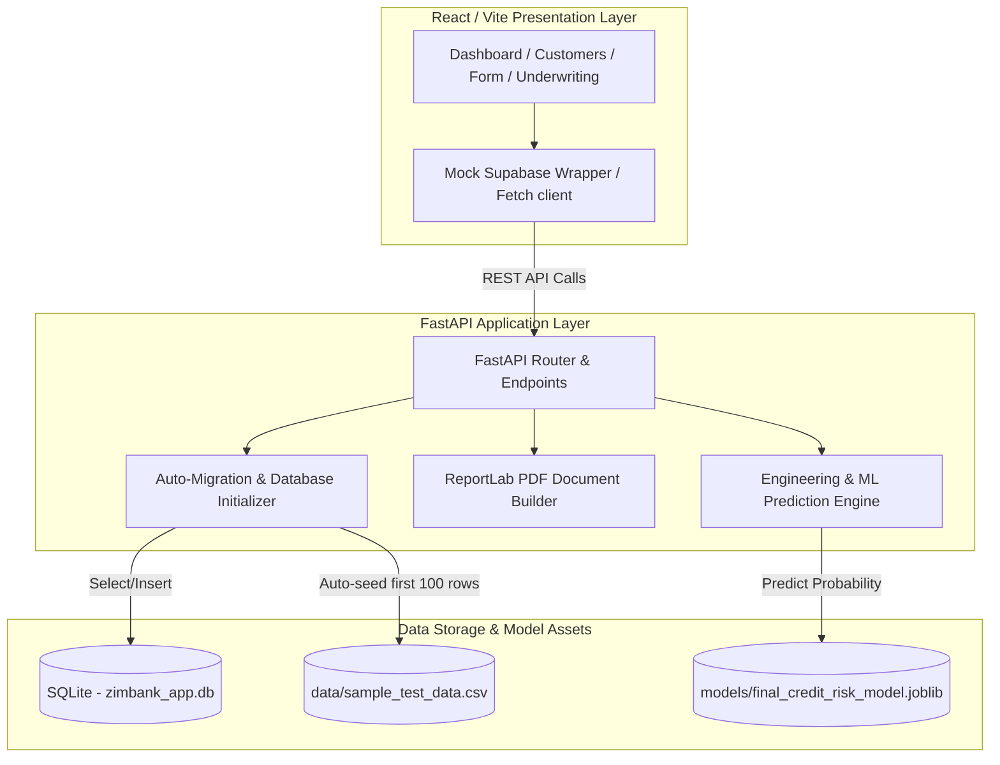

# 🏛️ ZimBank AI Credit Risk Underwriting Platform

An institutional-grade, Basel IV-compliant automated underwriting and credit risk assessment platform tailored for the Southern African (SADC) banking ecosystem. This platform combines a high-performance **FastAPI backend** (SQLite-backed, ensemble ML model predictions) with a premium **Vite + React + TypeScript frontend**.

---

## 📐 Platform Architecture

The platform separates the presentation layer from the core computation, scoring engine, and database store.



---

## ⚡ Key Features

*   **⚡ Real-Time Single Applications**: Input applicant data manually to perform immediate feature engineering and credit scoring with risk tiering.
*   **📊 Dynamic Dashboard Analytics**: Real-time KPI counters (active cases, approval rates, average default probabilities, and pending reviews) dynamically computed from the SQLite database.
*   **📂 Batch Credit Underwriting**: Drag and drop a credit ledger CSV file to automatically process, score, and view entire customer cohorts in a searchable, paginated table.
*   **📋 Basel IV Compliant PDF Reports**: Generate structured, institutional credit report PDFs with complete risk breakdowns, credit scoring factors, and automated next-steps workflows.
*   **🧬 Explainable AI Traceability**: Provides deterministic trace flags for risk components such as debt-to-income (DTI) ratio burden, employment stability, credit leverage, age, and loan-to-income limits.
*   **🔒 Local Workspace Authentication**: Lightweight local authentication that stores sessions in `localStorage` to allow quick deployment and offline development.

---

## 🛠️ Technology Stack

### Frontend
*   **Framework**: React 18 with Vite and TypeScript
*   **Iconography**: Lucide React
*   **Styling**: Modern Vanilla CSS, responsive layouts, smooth gradients, and glassmorphism.
*   **Theme**: Premium light-themed left panel with white gradients and refined contrast; dark/light-themed dashboard panels.

### Backend
*   **Framework**: FastAPI with Uvicorn server
*   **Database**: SQLite (`zimbank_app.db` with auto-migration/tables schema init)
*   **ML Libraries**: scikit-learn, pandas, NumPy, joblib (automatic fallback to simulation if specific model binaries are not present)
*   **PDF Engine**: ReportLab (dynamic document builder)

---

## 📂 Project Directory Structure

```text
zimbank-ai-underwriter/
├── backend/
│   ├── data/
│   │   └── sample_test_data.csv      # Seed data (first 100 records loaded on init)
│   ├── models/
│   │   └── final_credit_risk_model.joblib  # Trained machine learning model pipeline
│   ├── assets/                       # Static logo images & branding assets
│   ├── main.py                       # FastAPI application & SQLite controller
│   ├── requirements.txt              # Backend dependencies list
│   └── README.md                     # Backend API developer documentation
├── frontend/
│   ├── src/
│   │   ├── lib/
│   │   │   ├── config.ts             # Backend server target URL config
│   │   │   └── supabase.ts           # Mock Supabase adapter routing to local REST API
│   │   ├── pages/
│   │   │   ├── Login.tsx             # White-gradient branding & credential form
│   │   │   ├── Dashboard.tsx         # Dashboard metrics & batch CSV underwriting
│   │   │   ├── Customers.tsx         # Searchable customer database
│   │   │   ├── NewApplication.tsx    # Single application intake form
│   │   │   └── Underwriting.tsx      # Risk-tier breakdown, trace flags & PDF generation
│   │   ├── App.tsx                   # Page layout, routing & mock session check
│   │   ├── main.tsx                  # React DOM entrypoint
│   │   └── index.css                 # Core CSS design variables & global tokens
│   ├── package.json                  # Frontend dependencies list
│   └── vite.config.ts                # Vite config setup
└── README.md                         # Main workspace project guide (this file)
```

---

## 🚀 Setup & Installation

### 1. Backend Setup (FastAPI & SQLite)

1.  Navigate to the `backend` directory:
    ```bash
    cd backend
    ```
2.  Create and activate a virtual environment:
    ```bash
    python3 -m venv .venv
    source .venv/bin/activate
    ```
3.  Install dependencies:
    ```bash
    pip install -r requirements.txt
    ```
4.  Start the FastAPI application:
    ```bash
    python main.py
    ```
    > [!NOTE]
    > On startup, `main.py` checks if `zimbank_app.db` exists. If not, it creates the database and seeds it automatically with the first **100 records** from `data/sample_test_data.csv`. The server runs at `http://127.0.0.1:8000`.

### 2. Frontend Setup (React & Vite)

1.  Open a new terminal session and navigate to the `frontend` directory:
    ```bash
    cd frontend
    ```
2.  Install packages:
    ```bash
    npm install
    ```
3.  Launch the development server:
    ```bash
    npm run dev
    ```
    > [!TIP]
    > The application dev server will be available at `http://localhost:5173`. Make sure the backend server remains active on port `8000` to handle API requests.

---

## 🔑 Login Credentials

The local auth flow is designed for rapid onboarding. You can use **any email and password** containing at least 6 characters.

For standard testing, the following mock credentials can be used:
*   **Email**: `officer@zimbank.co.zw`
*   **Password**: `password`

---

## 📜 Underwriting & Policy Rules

The scoring engine categorizes applicants into three primary tiers:

| Default Probability | Risk Tier | Status / Directive |
| :--- | :--- | :--- |
| **< 35%** | **Tier A (Low Risk)** | Approved (Auto-pathway enabled) |
| **35% - 60%** | **Tier B (Medium Risk)** | Under Review (Escalated to Credit Committee) |
| **> 60%** | **Tier C (High Risk)** | Declined (Over policy limit) |

### Traceability Flags
*   **DTI Burden**: Triggered if debt-to-income ratio exceeds **45%**.
*   **LTI Limit**: Triggered if total loan amount exceeds **4.0x** monthly income.
*   **Stability Risk**: Triggered if time at current employer is less than **12 months**.
*   **Leverage Warning**: Triggered if existing obligations are present.
*   **Demographic Burden**: Triggered if number of dependents exceeds **3**.
